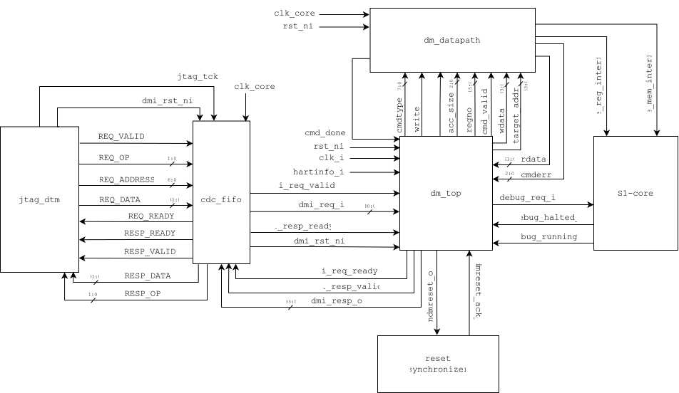

# Debug Module Controller (`dm_top`)

## Purpose
The `dm_top` module serves as the top-level controller for the RISC-V Debug Module (DM) in the MEDS-S1 platform. It acts as the bridge between the external Debug Transport Module (DTM) and the S1-Core, strictly adhering to the RISC-V Debug Specification. 

This implementation supports Run Control (halt, resume, reset) and Abstract Commands (register and memory access). It intentionally omits the Program Buffer and System Bus Access (SBA) blocks to reduce area, routing all memory and register requests through the hardware datapath (`dm_datapath`).

## Architecture & Interface Contract

The controller is divided into three primary state machines:
1. **DMI Decoder & Register File**: Decodes 41-bit DMI requests and manages standard DM registers (`dmcontrol`, `dmstatus`, `abstractcs`, `command`, `data0`-`data11`).
2. **Run Control FSM**: Manages hart execution states, tracking `debug_halted_o` and `debug_running_o`, and issuing `debug_req_i` to the core.
3. **Abstract Command FSM**: Validates debugger instructions, orchestrates the `cmd_valid`/`cmd_done` handshake with the datapath, and logs any execution errors via `cmderr`.

### Ports

| Port Name | Direction | Width | Description |
| :--- | :--- | :--- | :--- |
| **Clock & Reset** | | | |
| `clk_core` | Input | 1 | Core clock domain (target 100 MHz) |
| `rst_ni` | Input | 1 | Active-low, asynchronous assert, synchronous de-assert reset |
| **DMI Interface (via `cdc_fifo`)** | | | |
| `dmi_req_valid_i` | Input | 1 | DMI request valid signal |
| `dmi_req_i` | Input | 41 | DMI request bundle (7-bit address + 32-bit data + 2-bit op) |
| `dmi_req_ready_o` | Output| 1 | Controller ready to accept DMI request |
| `dmi_resp_valid_o` | Output| 1 | DMI response valid signal |
| `dmi_resp_o` | Output| 34 | DMI response bundle (32-bit data + 2-bit status) |
| `dmi_resp_ready_i` | Input | 1 | DTM ready to accept DMI response |
| **Core Run Control** | | | |
| `debug_req_i` | Output | 1 | Halt/resume request driven to the S1-Core |
| `debug_halted_o` | Input | 1 | Status flag indicating the core is halted |
| `debug_running_o` | Input | 1 | Status flag indicating the core is running |
| `hartinfo_i` | Input | 1 | Hart ID for multiplexing in multi-hart setups |
| **Datapath Interface** | | | |
| `cmdtype` | Output | 8 | Command type (0 = Register, 2 = Memory) |
| `write` | Output | 1 | 0 for Read, 1 for Write |
| `acc_size` | Output | 3 | Access size (8, 16, 32, 64, or 128-bit) |
| `regno` | Output | 16 | Target register address (for `cmdtype` = 0) |
| `cmd_valid` | Output | 1 | Trigger pulse to start datapath execution |
| `wdata` | Output | 64 | Data payload to be written to core/memory |
| `target_addr` | Output | 64 | Target memory address (for `cmdtype` = 2) |
| `cmd_done` | Input | 1 | Status pulse indicating datapath execution is complete |
| `rdata` | Input | 64 | Data payload read from core/memory |
| `cmderr` | Input | 3 | Hardware execution fault code from datapath |
| **System Reset** | | | |
| `ndmreset_o` | Output | 1 | Non-debug module reset request to the reset synchronizer |
| `ndmreset_ack_i` | Input | 1 | Acknowledgment from reset synchronizer |

## Timing & Reset Assumptions
* **Reset Policy**: Follows MEDS-S1 global policy (asynchronous assert, synchronous de-assert, active-low). No local resets or reset generation inside leaf modules.
* **`ndmreset`**: Driving `ndmreset_o` high resets the entire SoC platform *except* the Debug Module, DTM, and DMI.
* **Clock Domain Crossing**: The controller operates entirely within the `clk_core` domain. All asynchronous JTAG signals are safely bridged via the external `cdc_fifo` module prior to reaching `dm_top`.