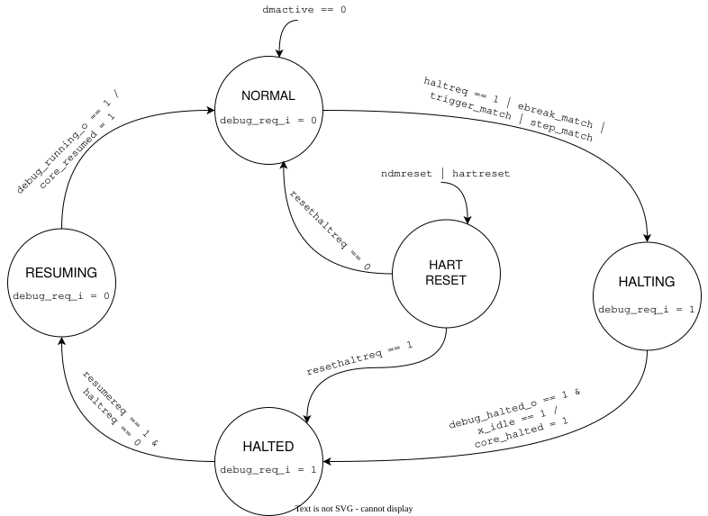
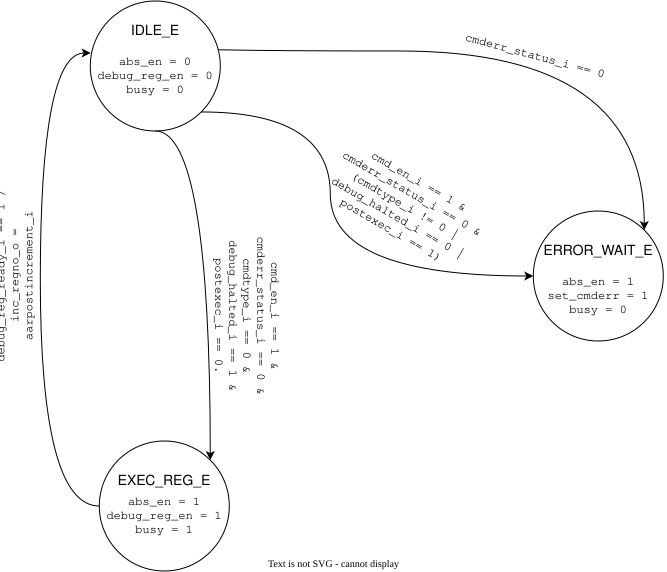
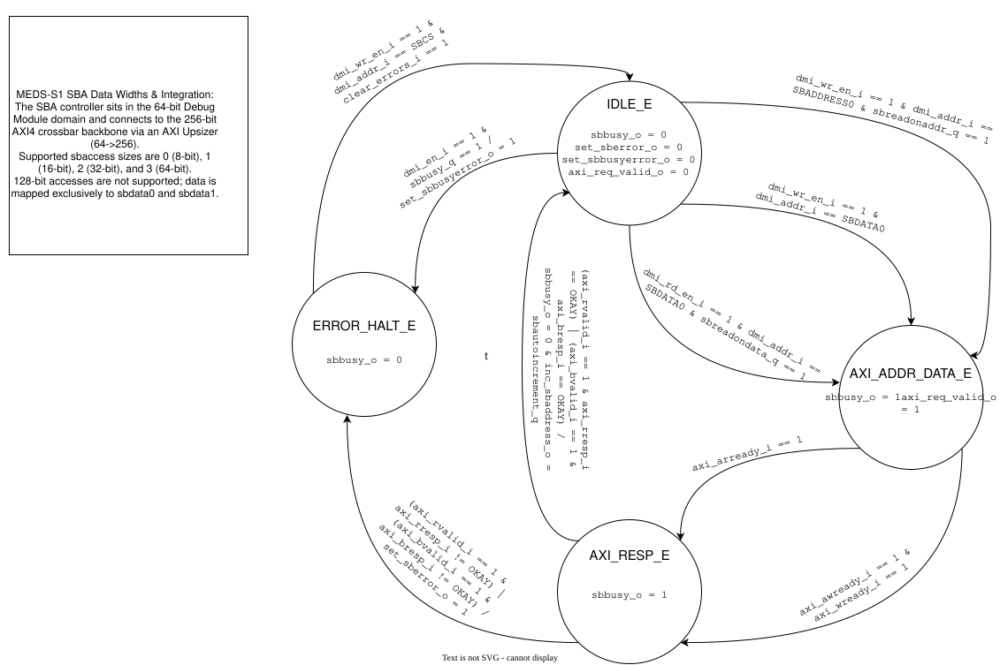

<!-- 
SPDX-License-Identifier: Apache-2.0
Copyright Maktab-e-Digital Systems Lahore
-->

# Debug Module State Machines & RTL Implementation

## Purpose
This document details the internal state machine architectures and SystemVerilog RTL implementation for the Debug Module Controller. It covers the three primary Finite State Machines (FSMs) that drive the controller's logic: the **Run Control FSM** (`meds_s1_run_ctrl.sv`), the **Abstract Command FSM** (`meds_s1_abs_ctrl.sv`), and the **System Bus Access (SBA) FSM** (`meds_s1_sba_ctrl.sv`). 

These state machines ensure strict compliance with the RISC-V Debug Specification by safely managing hart execution states, handling asynchronous resets, orchestrating register accesses without stalling the core pipeline incorrectly, and managing direct memory bus interactions. Furthermore, they strictly adhere to the MEDS-S1 interface conventions, testing methodologies, and clock domain isolation rules.

---

## 1. Run Control FSM (`meds_s1_run_ctrl.sv`)

The Run Control FSM manages the execution state of the connected S1-Core. It translates debugger requests (via the `dmcontrol` register) into physical control signals while monitoring the core's status. It implements a strict priority hierarchy for global overrides like `dmactive_i` and `ndmreset_i`.

### State Descriptions

*   **NORMAL_E:** The core is actively executing instructions or waiting for interrupts. The controller outputs `debug_req_o = 0`. It transitions to `HALTING_E` if a halt is requested (`haltreq_i == 1`), a trigger matches (`trigger_match_i`), an ebreak is hit (`ebreak_match_i`), or a step completes (`step_match_i`).
*   **HALTING_E:** The controller asserts the halt request to the core (`debug_req_o = 1`). It waits in this state until the core acknowledges the halt (`debug_halted_i == 1`) and the pipeline's coprocessor interface is fully idle (`x_idle_i == 1`). Once confirmed, it conditionally pulses `core_halted_o = 1` (as a Mealy output) and moves to `HALTED_E`.
*   **HALTED_E:** The core is safely in Debug Mode. The controller maintains `debug_req_o = 1`. It remains here until the debugger explicitly clears the halt request and asserts a resume request (`resumereq_i == 1 & haltreq_i == 0`).
*   **RESUMING_E:** The controller drops the halt request (`debug_req_o = 0`) to allow the core to exit Debug Mode. It waits for the core to confirm it is running again (`debug_running_i == 1`). Upon confirmation, it pulses `core_resumed_o = 1` and returns to `NORMAL_E`.
*   **HART_RESET_E:** Entered asynchronously from any state if a system or hart reset is triggered (`ndmreset_i | hartreset_i`). Upon exiting reset, the FSM checks `resethaltreq_i`. If `resethaltreq_i == 1`, it forces the FSM straight into the `HALTED_E` state; otherwise, it returns to `NORMAL_E`.

### Global Overrides
*   **`dmactive_i == 0`**: Highest priority override. If the Debug Module is deactivated, the FSM is forced immediately to `NORMAL_E`, overriding any pending halts or resets.

---

## 2. Abstract Command FSM (`meds_s1_abs_ctrl.sv`)

The Abstract Command FSM orchestrates the execution of debug commands written to the `command` register. It has been highly optimized into a 3-state machine that combinationally decodes commands to save execution latency. It controls the datapath and manages the `busy_o` and `cmderr` status flags.

### State Descriptions

*   **IDLE_E:** The FSM waits for a new command. The datapath is disabled (`abs_en_o = 0`, `debug_reg_en_o = 0`) and the `busy_o` bit is `0`. When a new command is triggered (`cmd_en_i == 1`) and there are no uncleared errors (`!cmderr_status_i`), the FSM combinationally decodes the command in the same cycle:
    *   **Success Path:** If it is a valid register access (`cmdtype_i == 8'h0`), the core is halted (`debug_halted_i == 1`), and it does *not* request the unsupported Program Buffer (`postexec_i == 0`), it proceeds directly to `EXEC_REG_E`.
    *   **Failure Path:** If the command type is unsupported, the core is running, or `postexec_i == 1` is requested, it aborts directly to `ERROR_WAIT_E`.
*   **EXEC_REG_E:** The FSM enables the datapath to perform the register access (`debug_reg_en_o = 1`, `abs_en_o = 1`) and asserts `busy_o = 1`. It waits for the datapath to finish (`debug_reg_ready_i == 1`). Upon completion, it asserts the Mealy output `inc_regno_o = aarpostincrement_i` and returns to `IDLE_E`.
*   **ERROR_WAIT_E:** Entered when a command fails validation. The FSM drops the `busy_o` flag but asserts `set_cmderr_o = 1` to log the failure. It remains locked in this state until the external debugger explicitly clears the error (`cmderr_status_i == 0`), after which it returns to `IDLE_E`.

---

## 3. System Bus Access FSM (`meds_s1_sba_ctrl.sv`)

The System Bus Access (SBA) FSM enables the Debug Module to perform direct memory operations independently of the hart. The controller sits in the 64-bit Debug Module domain and connects to the 256-bit AXI4 crossbar backbone via an AXI Upsizer (64->256). It natively supports `sbaccess` sizes of 0 (8-bit), 1 (16-bit), 2 (32-bit), and 3 (64-bit) mapped exclusively to the `SBDATA0` and `SBDATA1` DMI registers.

### State Descriptions

*   **IDLE_E:** The default waiting state where `sbbusy_o = 0`. The FSM transitions to `AXI_ADDR_DATA_E` to initiate a bus transaction under three conditions:
    1.  A DMI write to `SBADDRESS0` when `sbreadonaddr_q == 1`.
    2.  A DMI read from `SBDATA0` when `sbreadondata_q == 1`.
    3.  A DMI write to `SBDATA0`.
*   **AXI_ADDR_DATA_E:** The FSM asserts `sbbusy_o = 1` and `axi_req_valid_o = 1` to present the transaction to the AXI bus. It transitions to `AXI_RESP_E` once the AXI fabric is ready (`axi_arready_i == 1` for reads, or `axi_awready_i == 1 & axi_wready_i == 1` for writes). If a new DMI access attempts to interrupt this state (`dmi_en_i == 1`), the FSM asserts `set_sbbusyerror_o = 1` and aborts to `ERROR_HALT_E`.
*   **AXI_RESP_E:** The FSM waits for the AXI response while maintaining `sbbusy_o = 1`. 
    *   **Success:** If the AXI response is `OKAY` (`axi_rvalid_i == 1` or `axi_bvalid_i == 1`), it asserts `inc_sbaddress_o = sbautoincrement_q` and returns to `IDLE_E`.
    *   **Bus Error:** If the AXI response is not `OKAY`, it asserts `set_sberror_o = 1` to flag the transaction failure and moves to `ERROR_HALT_E`.
    *   **Busy Error:** Any new DMI access (`dmi_en_i == 1`) during this wait sets `set_sbbusyerror_o = 1` and moves to `ERROR_HALT_E`.
*   **ERROR_HALT_E:** The state used for error containment where `sbbusy_o = 0`. The FSM remains locked here, ignoring all transactions, until the debugger explicitly writes a `1` to `clear_errors_i` via the `SBCS` register. It then returns to `IDLE_E`.

---

## 4. RTL Implementation Details

All debug controllers are implemented in SystemVerilog using a strict, industry-standard two-block FSM pattern to ensure clean synthesis and glitch-free operation.

*   **Two-Block Architecture:** 
    *   A sequential `always_ff` block updates the `state_q` register on the positive edge of `clk_i` or the asynchronous, active-low reset `rst_ni`.
    *   A combinational `always_comb` block computes the `next_state_d` and drives all outputs based on the current state and inputs.
*   **Latch Prevention:** At the top of every `always_comb` block, all outputs (e.g., `debug_req_o`, `busy_o`, `axi_req_valid_o`) and the `next_state_d` variable are assigned default values (typically `1'b0` or `state_q`). All state evaluations use the `unique case` construct. This guarantees no inferred latches are created during synthesis.
*   **Mealy Outputs for Single-Cycle Pulses:** Signals like `core_halted_o`, `core_resumed_o`, and `inc_sbaddress_o` are implemented as Mealy outputs. Instead of being tied statically to a state, they are conditionally asserted *inside* the state transition logic. This ensures they pulse high for exactly one clock cycle precisely when the transition occurs.
*   **Safe Debug Entry:** The Run Control FSM explicitly waits for the `x_idle_i` signal before transitioning to `HALTED_E`. This fulfills the MEDS-S1 specification requirement that GDB must never observe a half-executed coprocessor operation during debug entry.

---

## 5. Unit Testing & Verification

Each controller module is verified by a dedicated testbench (`tb_meds_s1_run_ctrl.sv`, `tb_meds_s1_abs_ctrl.sv`, and `tb_meds_s1_sba_ctrl.sv`). These testbenches are designed to conform strictly to the MEDS-S1 continuous integration (CI) requirements:

*   **Standardized Check Helpers:** Hardcoded `$fatal` halts are replaced by a standardized `check1` helper task. This enables the testbench to catch multiple functional errors in a single simulation run instead of terminating on the first failure.
*   **Error Tracking & CI Compliance:** Every assertion dynamically tallies global `checks` and `errors` counters. At the conclusion of the test, the testbench issues a definitive `=== PASS : X checks ===` or `=== FAIL ===` payload. This output signature ensures CI pipelines can reliably distinguish between a test that passed perfectly and a test that failed to run altogether.
*   **Clock-Synchronous Stimulus:** Directed testing uses a standardized `step_clk()` automation task to advance the simulation cleanly across positive clock edges, ensuring realistic RTL behavior and preventing race conditions.